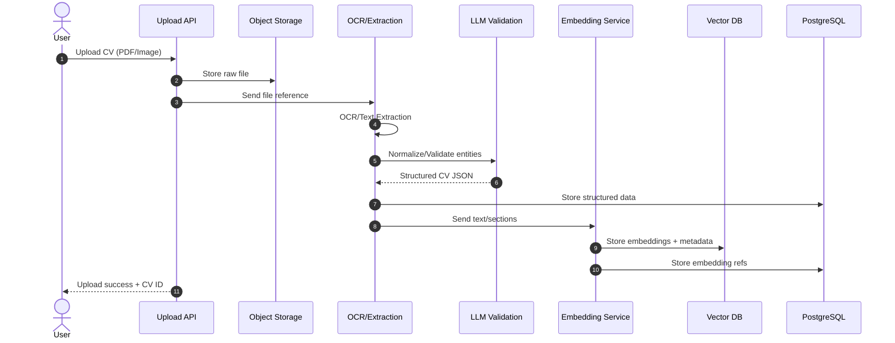
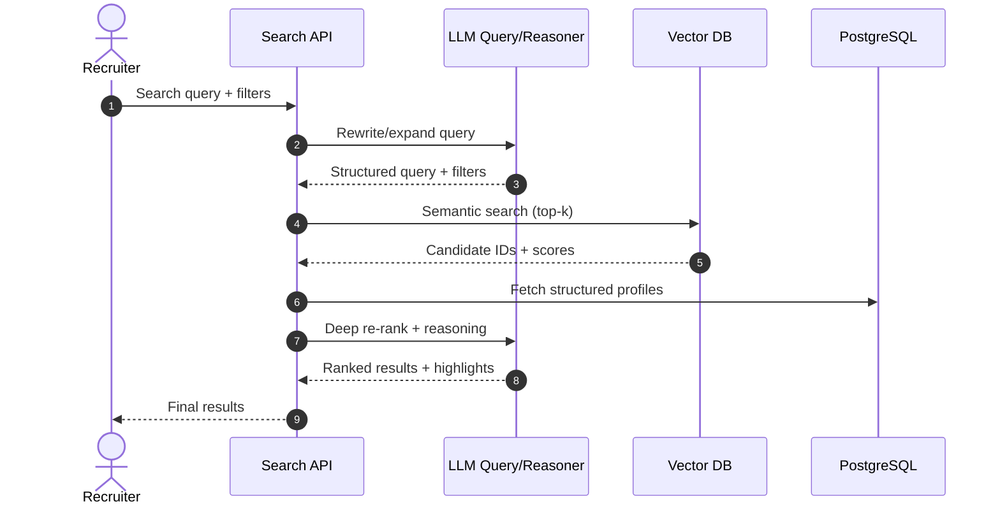

# CV Search AI System — High-Level Architecture (Plan Mode)

## Goals
- **Accuracy-first extraction**: robust OCR + layout-aware parsing + LLM validation to maximize structured data correctness.
- **Search relevance**: combine semantic vector search with LLM reasoning and strict filters to return high-quality candidates.

## System Overview
The system has two primary flows:

1. **Flow 1 — CV Upload → Extraction → Embedding → Storage**
2. **Flow 2 — AI Search (Semantic) & Deep Search (LLM Reasoning)**

Both flows share a common data model backed by **PostgreSQL + vector extension** and an external **Vector DB** for high-performance ANN retrieval.

## Flow 1: CV Upload → Extraction → Embedding → Storage

**Key stages**
1. **Upload Service**: handles file intake, validation, and storage (object storage).
2. **Extraction Pipeline**:
   - OCR (for scanned PDFs/images) + text extraction (for digital PDFs).
   - Layout-aware parsing (sections: education, experience, skills).
   - LLM-based validation/normalization (dates, titles, company names, skill ontology).
3. **Embedding Service**:
   - Generates embeddings for full CV and per-section slices.
   - Stores vectors in Vector DB and metadata in PostgreSQL.
4. **Storage**:
   - Raw files in object storage.
   - Structured JSON + derived entities in PostgreSQL.

### Mermaid Sequence Diagram — Upload Flow



## Flow 2: AI Search (Semantic Search & Deep Search)

**Key stages**
1. **Search API**: receives query (free text + filters + role requirements).
2. **Query Understanding**:
   - LLM reformulates query and expands skills.
   - Extracts hard filters (location, years, education, etc.).
3. **Semantic Search**:
   - Vector DB ANN search on candidate embeddings.
   - Returns top-k candidate IDs and scores.
4. **Deep Search (LLM Reasoning)**:
   - LLM re-ranks candidates using structured data + CV excerpts.
   - Outputs relevance reasoning and highlights.
5. **Result Assembly**:
   - Combine vector scores + LLM ranking + filters.

### Mermaid Sequence Diagram — Search Flow



## Tech Stack

**Core services**
- **API**: FastAPI or NestJS
- **Extraction**: Tesseract/TrOCR + pdfplumber + LLM validator
- **Embeddings**: OpenAI text-embedding-3-large or Gemini embedding model
- **Vector DB**: Pinecone or Milvus
- **Primary DB**: PostgreSQL + pgvector
- **Storage**: S3-compatible object storage
- **Queue/Workflow**: Redis Queue, Celery, or Temporal
- **Observability**: OpenTelemetry + Prometheus + Grafana

## Data Model (PostgreSQL + Vector Extension)

### Entities (high-level)
- **candidates**: core profile record
- **cv_documents**: raw file metadata and storage URI
- **cv_sections**: structured sections (experience, education, skills)
- **candidate_skills**: normalized skills with confidence scores
- **embeddings**: vector references per candidate/section

### Schema Outline

```sql
-- Core candidate profile
CREATE TABLE candidates (
  id UUID PRIMARY KEY,
  full_name TEXT,
  headline TEXT,
  location TEXT,
  years_experience NUMERIC,
  created_at TIMESTAMP,
  updated_at TIMESTAMP
);

-- Raw uploaded CV files
CREATE TABLE cv_documents (
  id UUID PRIMARY KEY,
  candidate_id UUID REFERENCES candidates(id),
  source_uri TEXT,
  file_type TEXT,
  uploaded_at TIMESTAMP
);

-- Structured sections parsed from CV
CREATE TABLE cv_sections (
  id UUID PRIMARY KEY,
  candidate_id UUID REFERENCES candidates(id),
  section_type TEXT, -- education, experience, skills
  section_content JSONB,
  created_at TIMESTAMP
);

-- Normalized skills
CREATE TABLE candidate_skills (
  id UUID PRIMARY KEY,
  candidate_id UUID REFERENCES candidates(id),
  skill_name TEXT,
  confidence NUMERIC,
  source_section_id UUID REFERENCES cv_sections(id)
);

-- Vector embeddings (pgvector)
CREATE TABLE embeddings (
  id UUID PRIMARY KEY,
  candidate_id UUID REFERENCES candidates(id),
  section_id UUID REFERENCES cv_sections(id),
  embedding VECTOR(1536), -- adjust to model
  model_name TEXT,
  created_at TIMESTAMP
);

CREATE INDEX embeddings_vector_idx ON embeddings USING ivfflat (embedding vector_cosine_ops);
```

## Accuracy & Relevance Strategies

**Extraction accuracy**
- Use multi-stage pipeline (OCR + parser + LLM validation).
- Normalize skill names against ontology.
- Confidence scores for extracted entities.
- Human review workflow for low-confidence CVs.

**Search relevance**
- Multi-vector strategy (full CV + section embeddings).
- Query rewriting and skill expansion via LLM.
- Re-ranking with structured data + LLM reasoning.
- Track relevance metrics and feedback loop.

## Next Steps (Approval Required)
- Confirm tech stack choices (vector DB + embedding provider).
- Validate schema expectations and any compliance constraints.
- After approval: move to detailed component design + implementation plan.
